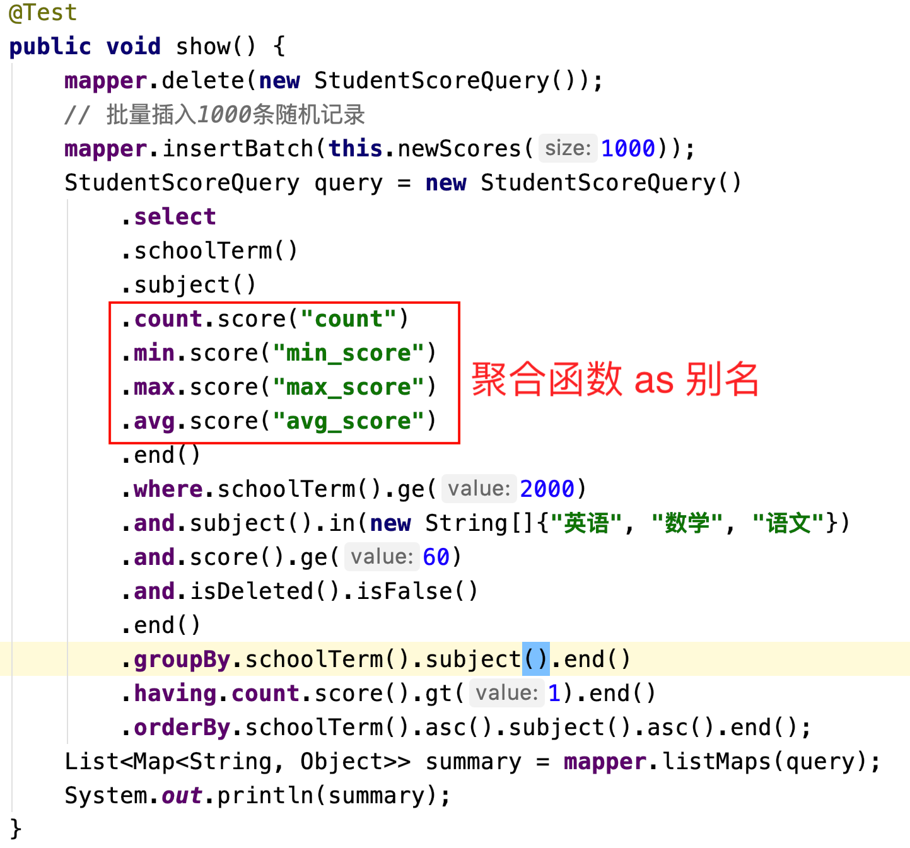
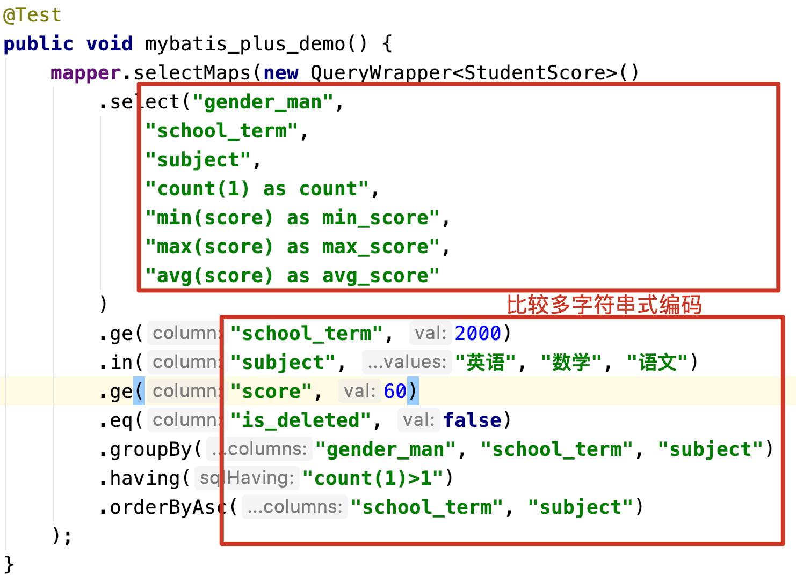

# Fluent Mybatis, 原生Mybatis, Mybatis Plus三者功能对比
使用fluent mybatis可以不用写具体的xml文件，通过java api可以构造出比较复杂的业务sql语句，做到代码逻辑和sql逻辑的合一。
不用再需要在Dao中组装查询或更新操作，在xml或mapper中再组装次参数。
那对比原生Mybatis, Mybatis Plus或者其他框架，FluentMybatis提供了哪些便利呢？

我们通过一个比较典型的业务需求来具体实现和对比下，假如有学生成绩表结构如下:
```sql
create table `student_score`
(
    id           bigint auto_increment comment '主键ID' primary key,
    student_id   bigint            not null comment '学号',
    gender_man   tinyint default 0 not null comment '性别, 0:女; 1:男',
    school_term  int               null comment '学期',
    subject      varchar(30)       null comment '学科',
    score        int               null comment '成绩',
    gmt_create   datetime          not null comment '记录创建时间',
    gmt_modified datetime          not null comment '记录最后修改时间',
    is_deleted   tinyint default 0 not null comment '逻辑删除标识'
) engine = InnoDB default charset=utf8;
```
现在有需求: 
**统计2000年三门学科('英语', '数学', '语文')及格分数按学期,学科统计最低分，最高分和平均分,
且样本数需要大于1条,统计结果按学期和学科排序**
我们可以写SQL语句如下

```sql
select school_term,
       subject,
       count(score) as count,
       min(score)   as min_score,
       max(score)   as max_score,
       avg(score)   as max_score
from student_score
where school_term >= 2000
  and subject in ('英语', '数学', '语文')
  and score >= 60
  and is_deleted = 0
group by school_term, subject
having count(score) > 1
order by school_term, subject;
```

那上面的需求，分别用fluent mybatis, 原生mybatis 和 Mybatis plus来实现一番。

### 使用fluent mybatis 来实现上面的功能



[具体代码](../../spring-boot-demo/src/test/java/cn/org/fluent/mybatis/springboot/demo/QueryDemo.java)

我们可以看到fluent api的能力，以及IDE对代码的渲染效果。

### 换成mybatis原生实现效果

1. 定义Mapper接口
```java
public interface MyStudentScoreMapper {
    List<Map<String, Object>> summaryScore(SummaryQuery paras);
}
```
2. 定义接口需要用到的参数实体 SummaryQuery
```java
@Data
@Accessors(chain = true)
public class SummaryQuery {
    private Integer schoolTerm;

    private List<String> subjects;

    private Integer score;

    private Integer minCount;
}
```
3. 定义实现业务逻辑的mapper xml文件

```xml
<select id="summaryScore" resultType="map" parameterType="cn.org.fluent.mybatis.springboot.demo.mapper.SummaryQuery">
    select school_term,
    subject,
    count(score) as count,
    min(score) as min_score,
    max(score) as max_score,
    avg(score) as max_score
    from student_score
    where school_term >= #{schoolTerm}
    and subject in
    <foreach collection="subjects" item="item" open="(" close=")" separator=",">
        #{item}
    </foreach>
    and score >= #{score}
    and is_deleted = 0
    group by school_term, subject
    having count(score) > #{minCount}
    order by school_term, subject
</select>
```
4. 实现业务接口(这里是测试类, 实际应用中应该对应Dao类)
```java
@RunWith(SpringRunner.class)
@SpringBootTest(classes = QuickStartApplication.class)
public class MybatisDemo {
    @Autowired
    private MyStudentScoreMapper mapper;

    @Test
    public void mybatis_demo() {
        // 构造查询参数
        SummaryQuery paras = new SummaryQuery()
            .setSchoolTerm(2000)
            .setSubjects(Arrays.asList("英语", "数学", "语文"))
            .setScore(60)
            .setMinCount(1);

        List<Map<String, Object>> summary = mapper.summaryScore(paras);
        System.out.println(summary);
    }
}
```
总之，直接使用mybatis，实现步骤还是相当的繁琐，效率太低。
那换成mybatis plus的效果怎样呢？

### 换成mybatis plus实现效果
mybatis plus的实现比mybatis会简单比较多，实现效果如下



但正如红框圈出的，写mybatis plus实现用到了比较多字符串的硬编码（可以用Entity的get lambda方法部分代替字符串编码）。
字符串的硬编码，会给开发同学造成不小的使用门槛，个人觉的主要有2点：

1. 字段名称的记忆和敲码困难
2. Entity属性跟随数据库字段发生变更后的运行时错误

其他框架，比如TkMybatis在封装和易用性上比mybatis plus要弱，就不再比较了。

## 三者对比总结
看完3个框架对同一个功能点的实现, 各位看官肯定会有自己的判断，笔者这里也总结了一份比较。

| - | Mybatis Plus | Fluent Mybatis |
| --- | --- | --- |
| 代码生成 | 生成 Entity, Mapper, Wrapper等文件, 并且Generator很好用 | 只生成Entity, 再通过编译生成 Mapper, Query, Update 和 SqlProvider |
| 和Mybatis的共生关系 | 需要替换原有的SqlSessionFactoryBean | 对Mybatis没有任何修改,原来怎么用还是怎么用 |
| 动态SQL构造方式 | 应用启动时, 根据Entity注解信息构造动态xml片段，注入到Mybatis解析器 | 应用编译时，根据Entity注解，编译生成对应方法的SqlProvider，利用mybatis的Mapper上@InsertProvider @SelectProvider @UpdateProvider注解关联 |
| 动态SQL结果是否容易DEBUG跟踪 | 不容易debug | 容易，直接定位到SQLProvider方法上，设置断点即可 |
| 动态SQL构造 | 通过硬编码字段名称, 或者利用Entity的get方法的lambda表达式 | 通过编译手段生成对应的方法名，直接调用方法即可 |
| 字段变更后的错误发现 | 通过get方法的lambda表达的可以编译发现，通过字段编码的无法编译发现 | 编译时便可发现 |
| 不同字段动态SQL构造方法 | 通过接口参数方式 | 通过接口名称方式, FluentAPI的编码效率更高 |
| 语法渲染特点 | 无 | 通过关键变量select, update, set, and, or可以利用IDE语法渲染, 可读性更高 | 

## Fluent Mybatis介绍和源码

[FluentMybatis文章序列](https://juejin.im/user/1811586730696142/posts)

[Fluent Mybatis文档&示例](https://gitee.com/fluent-mybatis/fluent-mybatis-docs)

[Fluent Mybatis源码, github](https://github.com/atool/fluent-mybatis)