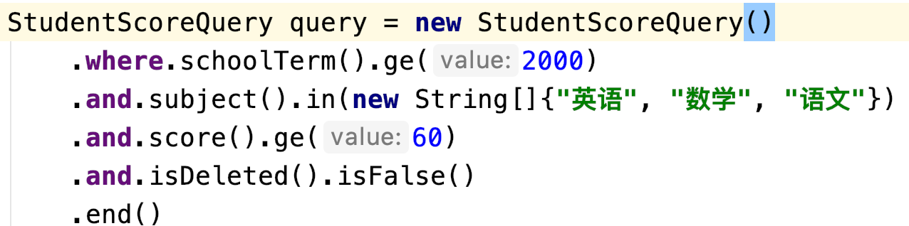
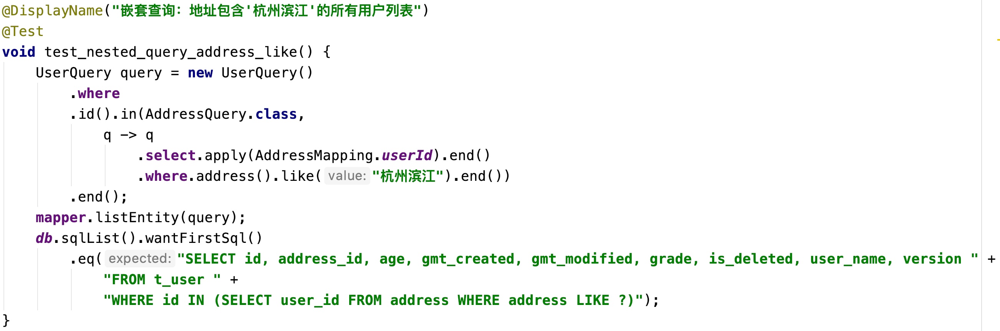
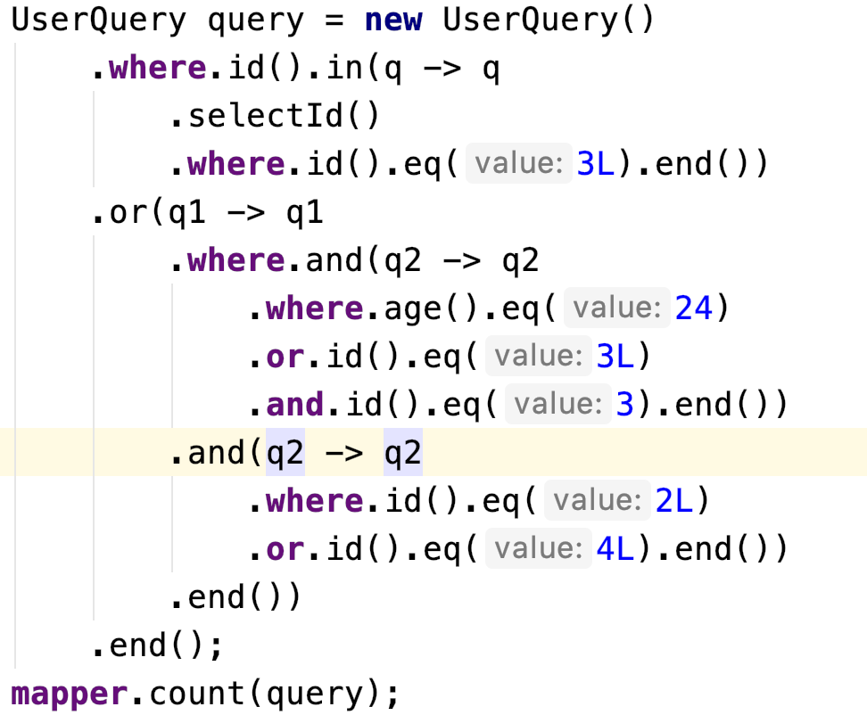
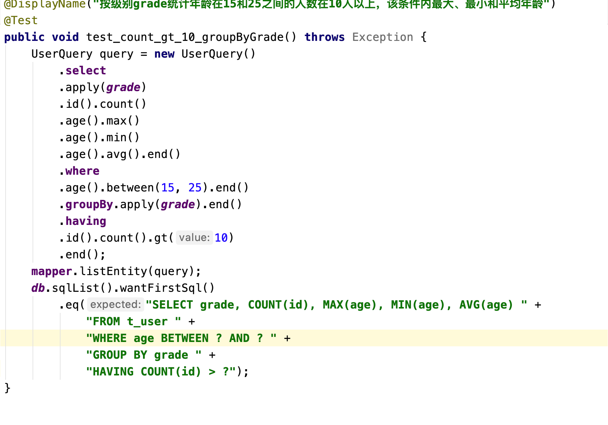
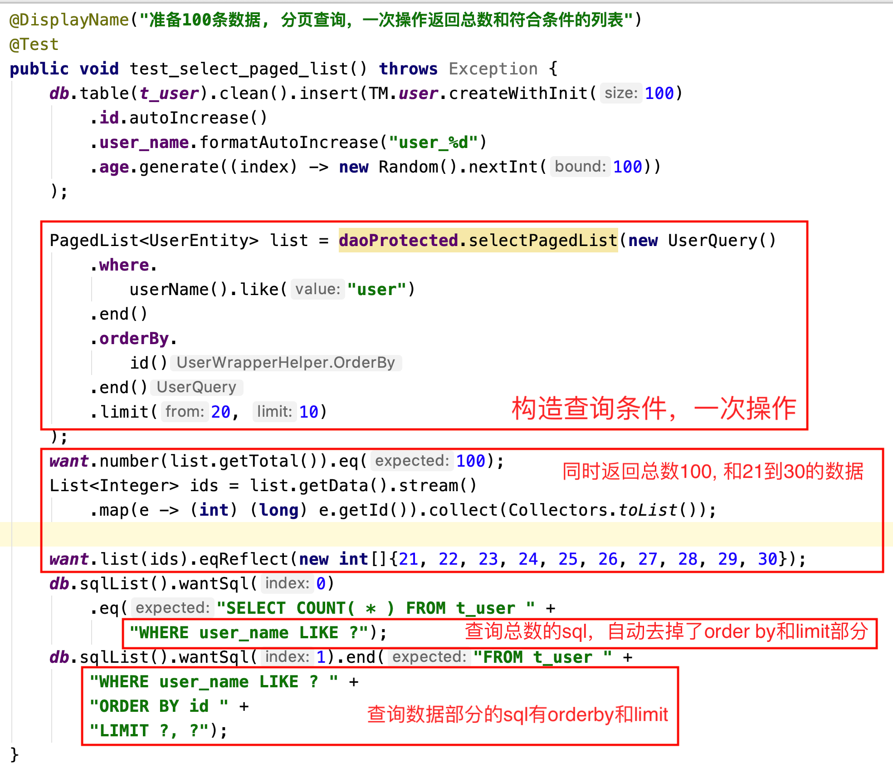
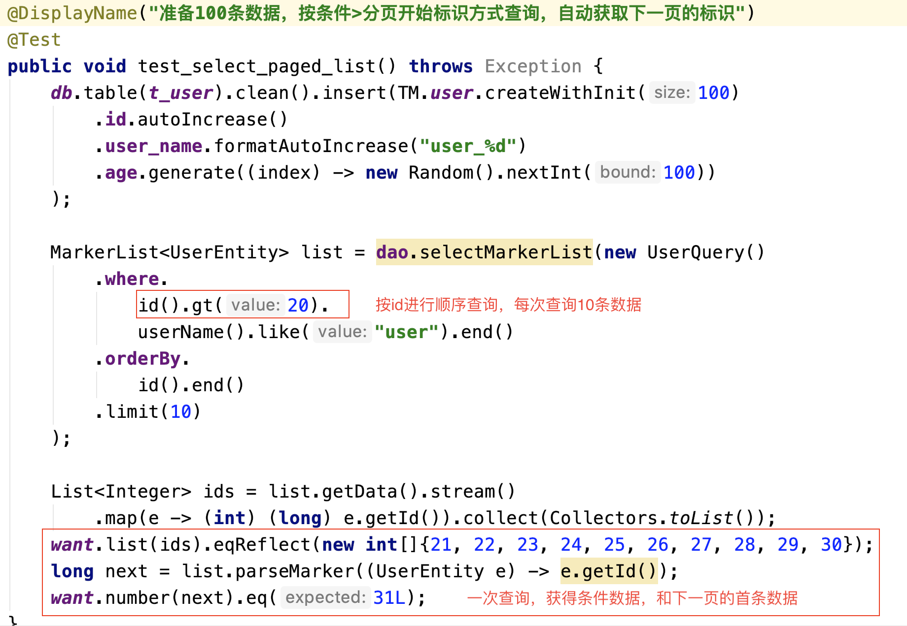

# Fluent Mybatis特性介绍

## No Xml & Mapper
FluentMybatis 值依赖*Entity 及Entity类上的注解 @FluentMybatis, 根据注解+Java Annotation Processor技术，
生成一系列辅助文件，这些文件在 target/annotation-processor目录下，工程可直接引用和打包，无需拷贝到src目录下，也不需要进行维护。
如果Entity类发生变更，重新执行编译打包即可。

## Fluent API, 一码到底
FluentMybatis根据Entity的属性给Query和Update类都生成了对应的属性方法，在构造动态条件的时候，
可以直接引用对应的方法进行链式设置。



1. 智能化的，语义化的流式接口，让你一气呵成写完sql操作
2. 流式动态接口，结合IDE的智能提示，最大限度的避免书写错误
3. 对不可空的参数会自动判断，避免粗心的程序员没有做前置检验导致的错误结果

## 和老工程, 老代码和谐共处
FluentMybatis没有对mybatis做任何修改，只是利用mybatis的特性做了些语法封装，最终的能力还是反映在Mapper和Mapper上的
注解(@SelectProvider, @InsertProvider, @UpdateProvider, @DeleteProvider)上。
在老工程中使用FluentMybatis，只需要把target/annotation-processor下的mapper路径加入扫描即可。
```java
@MapperScan({
    "你老工程的Mapper路径", 
    "FluentMybatis生成的Mapper路径"})
public class YourSpringConfig {
    
}
```
就这样，他们就可以一起工作了。

## 支持嵌套查询
FluentMybatis除了支持一般性的条件（相等，大于，小于，Like，Between，IN）之外，还支持嵌套查询

- IN嵌套
```sql
select * from table_1
where column_1 in (select column_1 from table_2 where ...)
```

- Exists嵌套
```sql
select * from table_1
where exists (select 1 from table_2 where ...)
```



[更多嵌套查询](../05-more-syntax/segment/04-nested-where.md)

## 根据条件构造SQL
可以组装出动态sql语句，但同时避免在dao类里面if else方式参数设置，也避免要在xml文件中设置一堆&lt;if test="..."&gt;
天然支持条件化的参数设置，增强了代码可读性；同时对必须设置条件的场景，进行的内置的判空操作，避免参数设置不当，导致全表扫描。


## AND & OR随意组合



对应Sql语句
```sql
SELECT COUNT(*)
FROM t_user
WHERE id IN (SELECT id FROM t_user WHERE id = ?)
   OR ((age = ? OR id = ? AND id = ?) AND (id = ? OR id = ?))
```

## 聚合函数支持
对聚合函数的支持，包括select 聚合函数 和 having 聚合函数判断



## 分页支持
- 传统分页方式
可以自动帮忙进行传统的分页操作, 只需要传入一个查询条件, 自动完成count查询
总数，和limit查询分页列表的操作。并且在查询总数的时候，自动去除了order by的部分，大大简化了分页查询



- 按tag取第一页分页方式
支持按标识进行分页的操作，每次查询会自动多查一条数据作为下一次查询的marker标识



## 按需查询
可以灵活指定需要查询的数据，减少数据传输    
 
## 和Test4J结合

结合[test4j](https://gitee.com/tryternity/test4j)单元测试工具，可以自动化的进行内存数据库方式测试，
并且无需提供脚本，框架会根据实体类自动生成数据库脚本，真正做到实时随地跑测试。
可以选择h2,速度快，但有少量语法和mysql不一致；也可以选择mariadb数据库，语法和mysql高度一致;
当然更可以支持实体数据库，方便查看测试过程中的数据。