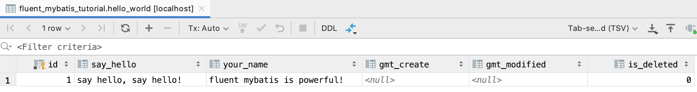
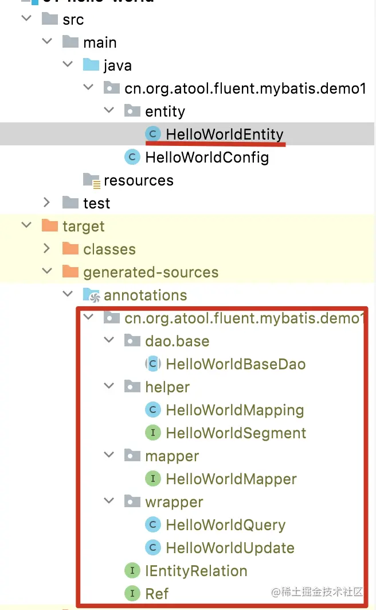

## 开始第一个例子: Hello World

### 新建Java工程，设置maven依赖
    新建maven工程，设置项目编译级别为Java8及以上，引入fluent mybatis依赖包。

```xml
<dependencies>
    <!-- 引入fluent-mybatis 运行依赖包, scope为compile -->
    <dependency>
        <groupId>com.github.atool</groupId>
        <artifactId>fluent-mybatis</artifactId>
        <version>1.9.7</version>
    </dependency>
    <!-- 引入fluent-mybatis-processor, scope设置为provider 编译需要，运行时不需要 -->
    <dependency>
        <groupId>com.github.atool</groupId>
        <artifactId>fluent-mybatis-processor</artifactId>
        <version>1.9.7</version>
    </dependency>
</dependencies>
```
[具体maven项目设置](pom.xml)

### 新建演示用的数据库结构
```mysql
create schema fluent_mybatis;

create table hello_world
(
    id           bigint unsigned auto_increment primary key,
    say_hello    varchar(100) null,
    your_name    varchar(100) null,
    gmt_created   datetime   DEFAULT NULL COMMENT '创建时间',
    gmt_modified datetime   DEFAULT NULL COMMENT '更新时间',
    is_deleted   tinyint(2) DEFAULT 0 COMMENT '是否逻辑删除'
) ENGINE = InnoDB
  CHARACTER SET = utf8 comment '简单演示表';
```
    
### 创建数据库表对应的Entity类
    创建数据库表对应的Entity类: HelloWorldEntity, 你只需要简单的做3个动作:
    
 1. 根据驼峰命名规则命名Entity类和字段
 2. HelloWorldEntity继承IEntity接口类
 3. 在HelloWorldEntity类上加注解 @FluentMybatis
     
```java
@FluentMybatis
public class HelloWorldEntity extends RichEntity {
    private Long id;

    private String sayHello;

    private String yourName;

    private Date gmtCreated;

    private Date gmtModified;

    private Boolean isDeleted;
    
    // get, set, toString 方法

   @Override
   public Class<? extends IEntity> entityClass() {
      return HelloWorldEntity.class;
   }
}
```
[HelloWorldEntity类](src/main/java/cn/org/atool/fluent/mybatis/demo1/entity/HelloWorldEntity.java)

执行编译:

**检查你的Entity工程是否包含了 fluent-mybatis-processor jar包**

1. IDE 编译


2. Maven编译
mvn clean compile

3. gradle编译
gradle clean compile

很简单吧，在这里，你即不需要配置任何mybatis xml文件, 也不需要写任何Mapper接口, 但你已经拥有了强大的增删改查的功能，并且是Fluent API，让我们写一个测试来见证一下Fluent Mybatis的魔法力量!

### 运行测试来见证Fluent Mybatis的神奇
为了运行测试, 我们还需要进行JUnit和Spring Test相关配置。
#### 配置spring bean定义
1. 数据源DataSource配置
2. mybatis的mapper扫描路径
3. mybatis的SqlSessionFactoryBean

```java
@ComponentScan(basePackages = "cn.org.atool.fluent.mybatis.demo1")
@MapperScan("cn.org.atool.fluent.mybatis.demo1.entity.mapper")
@Configuration
public class HelloWorldConfig {
    /**
     * 设置dataSource属性
     *
     * @return
     */
    @Bean
    public DataSource dataSource() {
        BasicDataSource dataSource = new BasicDataSource();
        dataSource.setDriverClassName("com.mysql.jdbc.Driver");
        dataSource.setUrl("jdbc:mysql://localhost:3306/fluent_mybatis?useUnicode=true&characterEncoding=utf8");
        dataSource.setUsername("root");
        dataSource.setPassword("password");
        return dataSource;
    }

    /**
     * 定义mybatis的SqlSessionFactoryBean
     *
     * @param dataSource
     * @return
     */
    @Bean
    public SqlSessionFactoryBean sqlSessionFactoryBean(DataSource dataSource) {
        SqlSessionFactoryBean bean = new SqlSessionFactoryBean();
        bean.setDataSource(dataSource);
        return bean;
    }

   @Bean
   public MapperFactory mapperFactory() {
      return new MapperFactory();
   }
}
```

#### 使用Junit4和Spring-test来执行测试
1. 使用spring-test初始化spring容器
2. 注入HelloWorldEntity对应的Mapper类: HelloWorldMapper, 这个类是fluent mybatis编译时生成的。
3. 使用HelloWorldMapper进行删除、插入、查询、修改操作。

```java
@RunWith(SpringJUnit4ClassRunner.class)
@ContextConfiguration(classes = HelloWorldConfig.class)
public class HelloWorldTest {
    /**
     * fluent mybatis编译时生成的Mapper类
     */
    @Autowired
    HelloWorldMapper mapper;

    @Test
    public void testHelloWorld() {
        /**
         * 为了演示方便，先删除数据
         */
        mapper.delete(mapper.query()
            .where.id().eq(1L).end());
        /**
         * 插入数据
         */
        HelloWorldEntity entity = new HelloWorldEntity();
        entity.setId(1L);
        entity.setSayHello("hello world");
        entity.setYourName("fluent mybatis");
        entity.setIsDeleted(false);
        mapper.insert(entity);
        /**
         * 查询 id = 1 的数据
         */
        HelloWorldEntity result1 = mapper.findOne(mapper.query()
            .where.id().eq(1L).end());
        /**
         * 控制台直接打印出查询结果
         */
        System.out.println("1. HelloWorldEntity:" + result1.toString());
        /**
         * 更新id = 1的记录
         */
        mapper.updateBy(mapper.updater()
            .set.sayHello().is("say hello, say hello!")
            .set.yourName().is("fluent mybatis is powerful!").end()
            .where.id().eq(1L).end()
        );
        /**
         * 查询 id = 1 的数据
         */
        HelloWorldEntity result2 = mapper.findOne(mapper.query()
            .where.sayHello().like("hello")
            .and.isDeleted().eq(false).end()
            .limit(1)
        );
        /**
         * 控制台直接打印出查询结果
         */
        System.out.println("2. HelloWorldEntity:" + result2.toString());
    }
}
```

执行Junit4测试方法，控制台输出

```text
1. HelloWorldEntity:HelloWorldEntity{id=1, sayHello='hello world', yourName='fluent mybatis', gmtCreate=null, gmtModified=null, isDeleted=false}
2. HelloWorldEntity:HelloWorldEntity{id=1, sayHello='say hello, say hello!', yourName='fluent mybatis is powerful!', gmtCreate=null, gmtModified=null, isDeleted=false}
```
神奇吧！ 我们再到数据库中查看一下结果



现在，我们已经通过一个简单例子演示了fluent mybatis的强大功能，
在进一步介绍fluent mybatis更强大功能前，我们揭示一下为啥我们只写了一个数据表对应的Entity类，
却拥有了一系列增删改查的数据库操作方法。

fluent mybatis根据Entity类上@FluentMybatis注解在编译时，
会在target目录class目录下自动编译生成一系列文件：



- 核心接口类, 使用时需要了解
  1. mapper/*Mapper: mybatis的Mapper定义接口, 定义了一系列通用的数据操作接口方法。
  2. dao/*BaseDao: Dao实现基类, 所有的DaoImpl都继承各自基类
    根据分层编码的原则，我们不会在Service类中直接使用Mapper类，而是引用Dao类。我们在Dao实现类中根据条件实现具体的数据操作方法。
  3. wrapper/*Query: fluent mybatis核心类, 用来进行动态sql的构造, 进行条件查询。
  4. wrapper/*Updater: fluent mybatis核心类, 用来动态构造update语句。
  5. helper/*Mapping: Entity表字段和Entity属性映射定义类
  6. helper/*Segment: Query和Updater具体功能实现, 包含几个实现:select, where, group by, having by, order by, limit
  7. IEntityRelation: 处理Entity关联(一对一, 一对多, 多对多)关系的接口
  8. Ref: 引用FluentMybatis生成的对象的快捷入口工具类
  
[Hello World, 表和Entity映射](../00-docs/02-advanced-hello-world/README.md)

[FluentMybatis 源码Gitee](https://gitee.com/fluent-mybatis/fluent-mybatis)

[Fluent Mybatis源码, github](https://github.com/atool/fluent-mybatis)

[Fluent Mybatis文档&示例](https://gitee.com/fluent-mybatis/fluent-mybatis-docs)