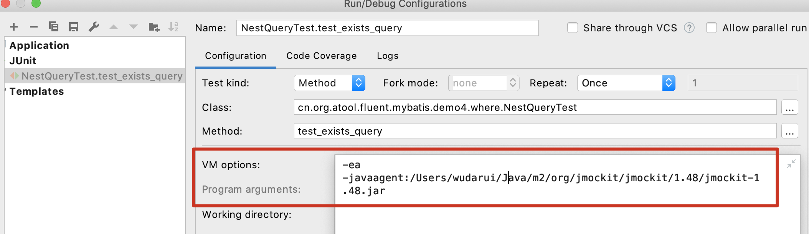

## 嵌套查询
使用Fluent Mybatis, 不用手写一行xml文件或者Mapper文件，在dao类中即可使用java api构造中比较复杂的嵌套查询。
让dao的代码逻辑和sql逻辑合二为一。

#### in (select 子查询)
- 嵌套查询表和主查询表一样的场景

.column().in( query-> {对query设置条件})

只需要在in里面引用一个lambda表达式，lambda表达式入参是一个同名的Query。对这个入参可以设置where参数。

``` java
@DisplayName("嵌套查询和主查询的表是同一个")
@Test
void test_in_same_table_query() {
    UserQuery query = new UserQuery()
        .where.id().in(q -> q.selectId()
            .where.id().eq(3L).end())
        .and.userName().like("user")
        .and.age().gt(23).end();

    List list = mapper.listEntity(query);
    db.sqlList().wantFirstSql()
        .eq("SELECT id, gmt_create, gmt_modified, is_deleted, account, age, avatar, birthday, bonus_points, e_mail, password, phone, status, user_name " +
            "FROM user WHERE id IN (SELECT id FROM user WHERE id = ?) " +
            "AND user_name LIKE ? " +
            "AND age > ?");
}
```

- 嵌套查询表是另外表的场景
.column().in(query)

如果嵌套查询的不是同表一张表，需要在in方法里面显式声明一下Query对象的class类型, 后面用法同方法一。

``` java
@DisplayName("嵌套查询和主查询的表是不同")
@Test
void test_in_difference_table_query() {
    UserQuery query = new UserQuery()
        .selectId()
        .where.addressId().in(new ReceivingAddressQuery().selectId()
            .where.id().in(new int[]{1, 2}).end())
        .end();
    mapper.listEntity(query);
    db.sqlList().wantFirstSql()
        .eq("SELECT id " +
            "FROM user " +
            "WHERE address_id IN (SELECT id FROM receiving_address WHERE id IN (?, ?))");
}
```

- not in嵌套查询: 使用方法同 in 嵌套查询

#### exists (select子查询)
- 嵌套查询表和主查询表一样的场景
Exists查询不需要指定字段，直接在query where中可以引用exists方法。

1. exists( query-> {对query设置条件})
如果exists查询的表和主查询一致，直接在lambada表达式中使用同类型query参数即可，参数用法同in方法。

2. exists(queryClass, query-> {对query设置条件})
如果exists查询的表和主查询不一致，在exists方法第一个参数指定query类型，第二个参数同方法1。

具体示例

``` java
@DisplayName("EXISTS查询")
@Test
void test_exists_query() {
    UserQuery query = new UserQuery()
        .where.exists(new ReceivingAddressQuery()
            .where.detailAddress().like("杭州")
            .and.id().apply(" = user.address_id").end())
        .end();
    mapper.listEntity(query);
    db.sqlList().wantFirstSql()
        .eq("SELECT id, gmt_create, gmt_modified, is_deleted, account, address_id, age, avatar, birthday, bonus_points, e_mail, password, phone, status, user_name " +
                "FROM user " +
                "WHERE EXISTS (SELECT *" +
                "   FROM receiving_address" +
                "   WHERE detail_address LIKE ?" +
                "   AND id = user.address_id)",
            StringMode.SameAsSpace);
}
```

注：示例中的测试，是使用H2内存数据库，你可以直接运行，不需要你额外建表。
但使用Test4J执行测试，你需要在加入vm参数：-javaagent:/这里是你本地maven仓库地址/org/jmockit/jmockit/1.48/jmockit-1.48.jar
以我本机为例，具体参数如图：



