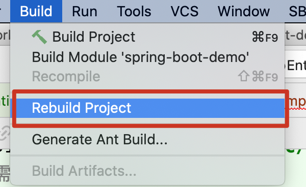
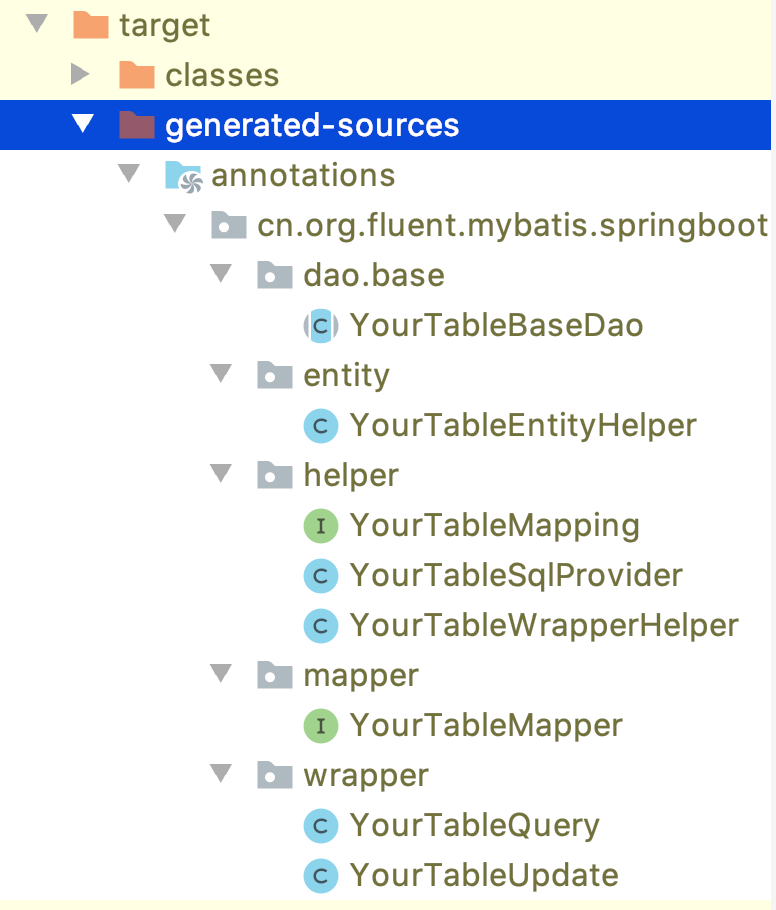

## 引言
Java中常用的ORM框架主要是mybatis, hibernate, JPA等框架。
国内又以Mybatis用的多，基于mybatis上的增强框架，又有mybatis plus和TK mybatis等。
今天我们介绍一个新的mybatis增强框架 fluent mybatis, 
那既然JDBC --> Mybatis或Mybatis Plus无疑简化了开发者的工作，而今天我们所讲的 Fluent MyBatis又起到什么作用呢？

## 初识Fluent MyBatis
Fluent MyBatis是一个 MyBatis 的增强工具，他只做了mybatis的语法糖封装，没有对mybatis做任何修改。
通过编译手段，提供了一系列辅助类来帮助开发简化开发、提高效率。

### 入门初体验
创建一个示例的数据库表
```sql
DROP TABLE IF EXISTS `your_table`;
create table `your_table`
(
    id bigint auto_increment comment '主键ID' primary key,
    name varchar(30) charset utf8 null comment '姓名',
    age int null comment '年龄',
    email varchar(50) charset utf8 null comment '邮箱',
    gmt_create datetime null comment '记录创建时间',
    gmt_modified datetime null comment '记录最后修改时间',
    is_deleted tinyint(2) default 0 null comment '逻辑删除标识'
);
```

### 初始化 SpringBoot 项目

- 设置项目依赖
1. spring boot: 基于spring boot开发，肯定是必须的
2. lombok: 省略get, set, toString代码的神器，个人比较喜欢；你也可以手动生成get set方法
3. mysql-connector-java: 数据库驱动
4. fluent-mybatis: fluent-mybatis运行时依赖
5. fluent-mybatis-processor: fluent-mybatis编译时依赖
6. fluent-mybatis-generator: fluent-mybatis代码生成依赖
6. 测试依赖的jar包: spring-test, junit

[maven pom具体配置](pom.xml)

- 配置数据库信息
```properties
spring.datasource.username=root
spring.datasource.password=password
spring.datasource.url=jdbc:mysql://localhost:3306/fluent_mybatis?useSSL=false&useUnicode=true&characterEncoding=utf-8
spring.datasource.driver-class-name=com.mysql.jdbc.Driver
```

- 创建实体类
可以手工创建Entity类，或者任何手段创建的Entity类，然后加上下面注解
1. 在Entity类上加上 @FluentMybatis注解
2. 在主键字段加 @TableId注解
3. 在一般字段加 @TableField注解

这里直接使用fluent mybatis提供的工具类生成代码
```java
public class AppEntityGenerator {
    static final String url = "jdbc:mysql://localhost:3306/fluent_mybatis?useSSL=false&useUnicode=true&characterEncoding=utf-8";

    public static void main(String[] args) {
        FileGenerator.build(Abc.class);
    }

    @Tables(
        /** 数据库连接信息 **/
        url = url, username = "root", password = "password",
        /** Entity类parent package路径 **/
        basePack = "cn.org.fluent.mybatis.springboot.demo",
        /** Entity代码源目录 **/
        srcDir = "spring-boot-demo/src/main/java",
        /** Dao代码源目录 **/
        daoDir = "spring-boot-demo/src/main/java",
        /** 如果表定义记录创建，记录修改，逻辑删除字段 **/
        gmtCreated = "gmt_create", gmtModified = "gmt_modified", logicDeleted = "is_deleted",
        /** 需要生成文件的表 **/
        tables = @Table(value = {"your_table"})
    )
    static class Abc {
    }
}
```
这里有3个特殊字段
1. gmt_create, 记录创建时间，会设置记录插入的默认值，对应生成Entity字段上的注解 @TableField(insert="now()")
2. gmt_modified, 记录最后更新时间，会设置记录插入和更新默认值，对应生成代码Entity字段上注解  @TableField(insert="now()", update="now()")
3. is_deleted, 记录逻辑删除标识，字段类型为Boolean，且设置记录插入的默认值，对应注解 @TableField(insert="0")

执行生成代码main函数, 在工程main/src/java目录下产出 Entity, DaoIntf, DaoImpl文件；
观察YourEntity的主键 id, gmt_create, gmt_modified, is_deleted这几个字段的注解
```java
@Data
@Accessors(chain = true)
@FluentMybatis(table = "your_table")
public class YourEntity implements IEntity{
    private static final long serialVersionUID = 1L;

    @TableId(value = "id")
    private Long id;

    @TableField(value = "gmt_create", insert = "now()")
    private Date gmtCreate;

    @TableField(value = "gmt_modified", insert = "now()", update = "now()")
    private Date gmtModified;

    @TableField(value = "is_deleted", insert = "0")
    private Boolean isDeleted;

    @TableField(value = "age")
    private Integer age;

    @TableField(value = "email")
    private String email;
 
    @TableField(value = "name")
    private String name;

    @Override
    public Serializable findPk() {
        return id;
    }
}
```
生成的Dao文件，引用到了YourTableBaseDao类，这个类需要根据Entity类编译生成，在重新编译前会有编译错误，所以生成代码后需要重新Rebuild下
```java
@Repository
public class YourDaoImpl extends YourBaseDao implements YourDao {
    // 在这里添加你自己的业务逻辑代码
}
```


碰到上面这种编译错误，不要慌张，编译工程即可！



在Rebuild后，会在target目录下就会多出几个文件, 重新刷新一下工程把target/generated-sources加到源目录上即可。


- 启动SpringBoot测试，验证效果

这时工程已经具备fluent mybatis强大的增删改查功能了。我们创建一个测试类来验证一下，在测试类中注入 YourMapper，这里演示一个查询所有的方法，所以使用了 listEntity ，其参数是一个Query对象。

```java
@SpringBootTest(classes = QuickStartApplication.class)
public class FluentMybatisApplicationTest {
    @Autowired
    private YourMapper yourMapper;

    @Test
    void contextLoads() {
        List<YourEntity> list = yourMapper.listEntity(yourMapper.query());
        for (YourEntity entity : list) {
            System.out.println(entity);
        }
    }
}
```
你可以手工往数据库中插入几条记录，验证一下效果。

## Entity对应的Mapper提供的数据操作方法
下面我们分别介绍FluentMybatis提供的insert, select, update和delete方法，内容的介绍基本按4部分解析
1. 方法的Mapper定义（**编译生成的代码**）
2. Mapper对应的动态SQL组装SQLProvider（**编译生成的代码**）
3. 一个验证测试例子
4. 根据例子打印的SQL语句和信息输出，对照查看

### [insert方法](docs/01-insert.md)
- [int insert(YourEntity entity): 单条插入](docs/01-insert.md#insert)
- [int insertBatch(List<YourEntity> entities): 批量插入](docs/01-insert.md#insertbatch)

### [select查询方法](docs/02-select.md)
- [YourEntity findById(Serializable id): 根据id查询单条记录](docs/02-select.md#findbyid)
- [List<YourEntity> listByIds(Collection ids): 根据id列表查询](docs/02-select.md#listbyids)
- [YourEntity findOne(IQuery query): 根据自定义条件查询单条记录](docs/02-select.md#findone)
- [List<YourEntity> listByMap(Map map): 根据map中key=value构造条件查询](docs/02-select.md#listbymap)
- [List<YourEntity> listEntity(IQuery query): 根据自定义条件查询](docs/02-select.md#listentity)
- [List<Map> listMaps(IQuery query): 根据自定义条件查询](docs/02-select.md#listmaps)
- [List listObjs(IQuery query): 根据自定义条件查询](docs/02-select.md#listobjs)
- [Integer count(IQuery query): 根据自定义条件(包含limit)查询总数](docs/02-select.md#count)
- [Integer countNoLimit(IQuery query): 根据自定义条件(排除limit)查询总数](docs/02-select.md#countnolimit)

### [update更新方法](docs/03-update.md)
- [updateById: 根据entity实例id属性更新其它非null属性](docs/03-update.md#updatebyid)
- [updateBy: 动态设置更新操作](docs/03-update.md#updateby)

### [delete方法](docs/04-delete.md)
- [int deleteById(Serializable id): 按主键删除](docs/04-delete.md#deletebyid)
- [int deleteByIds(Collection idList): 按主键列表批量删除](docs/04-delete.md#deletebyids)
- [int delete(IQuery query): 按自定义条件删除](docs/04-delete.md#delete)
- [int deleteByMap(Map map): 按map中key=value构造条件删除](docs/04-delete.md#deletebymap)

## 链接
[FluentMybatis入门介绍二](Fluent-Mybatis-StepByStep2.md)